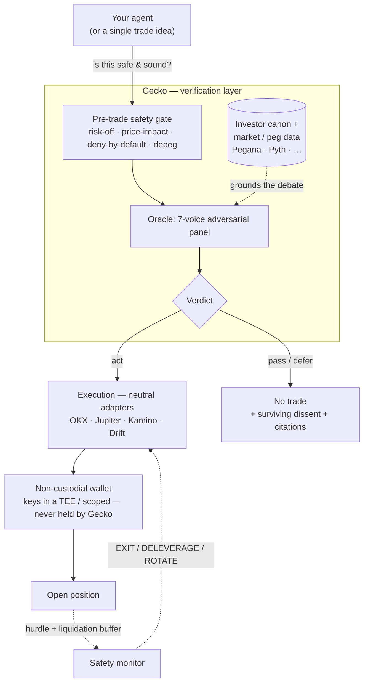

Gecko sits **above** any trading agent. An agent (yours, or one of ours) doesn't
trade and then hope — it asks Gecko *"is this safe and sound?"* first, and only
acts on a grounded verdict. Here's the whole flow on one napkin.

## The workflow, step by step

1. **Intent.** An agent forms a trade or yield decision — "deposit USDC into Kamino," "long SOL," "rotate this LST." It does **not** execute yet.
2. **Pre-trade safety gate.** The intent hits the gate: market-temperature (risk-on/off), price-impact caps, deny-by-default rules, and **depeg risk** on the collateral/target asset (via [Pegana](https://api.pegana.xyz) and other peg/market feeds). A failing gate stops the trade cold.
3. **The oracle verdict.** For a real judgment call, a **7-voice adversarial panel** debates the idea — grounded in external **investor canon** (Marks, Damodaran, Berkshire) and live market data, not Gecko's own opinion. It returns a verdict with **surviving dissent** (the strongest argument *against* that wasn't refuted) and **citations**.
4. **Decision — `act` / `pass` / `defer`.** A `pass` or `defer` *is the product*: the trade doesn't happen, and you see exactly why. A verdict with no honest dissent is a red flag, not a green light.
5. **Execution.** On `act`, the order dispatches through **neutral execution adapters** (OKX, Jupiter, Kamino, Drift) — swappable plumbing, never hard-coded to one venue.
6. **Custody.** Signing happens in a **non-custodial** wallet — keys generated in and never leaving a TEE (OKX Agentic Wallet) or a scoped embedded wallet. Gecko never holds your private key, and withdrawal is never gated.
7. **Monitor.** Open yield positions are watched against a **hurdle rate** and a **liquidation buffer**; the monitor de-risks (EXIT / DELEVERAGE / ROTATE) *before* a position bleeds — looping back into execution.
8. **Rigor, before any of this.** Strategies are graded with **default-REJECT** backtest rigor (CPCV / PBO / Deflated Sharpe) before they're ever deployed. An honest *null* is a valid, cheap outcome.

## Why this shape

| Layer | What it owns | Why it's separate |
|---|---|---|
| **Coach** | Turns a plain-language goal into a schema-validated strategy spec | Humans/agents describe intent; the spec is machine-checkable |
| **Oracle** | The grounded verdict + dissent + citations | Independence — the verifier is **not** the thing that wants to trade, and isn't paid when you do |
| **Execution** | Signs + sends through neutral adapters | Venue/chain-neutral; the verification works above any of them |

The trading bot and the profit vault in these docs are **proof artifacts** that exercise this flow on live capital. The product is the layer — the gate, the dissent, and the rigor — never a PnL number.

<Note>Non-custodial throughout: an agent never hands Gecko a private key, and the kill-switch can halt **execution** without ever touching **withdrawal**.</Note>
